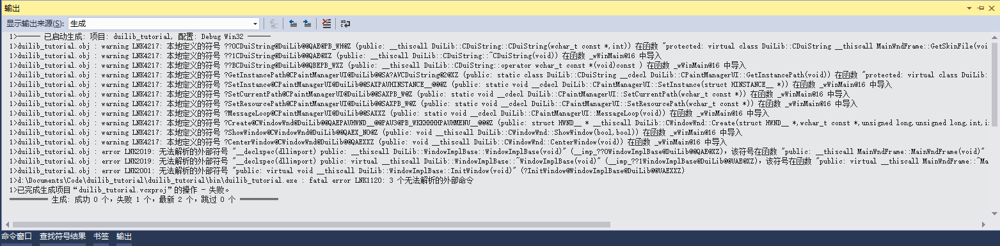
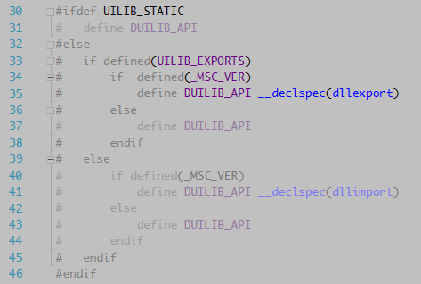

# 制作一个简单的界面

在实现这个基本窗口之前，我们首先根据自己的习惯设置一下 DuiLib 编译后生成的文件路径和项目依赖的头文件目录。你不一定要按着我的修改，符合你自己的使用习惯即可。要修改的位置主要有一下几个。修改过程比较繁琐，主要还是因为 DuiLib 是从 VC6 升级上来的，很多属性需要删除和修改，也有些属性是 DuiLib 团队自己的目录结构风格，改与不改不影响使用。

 - 常规->输出路径
 - 常规->中间目录（DLL 和 LIB 不能有冲突）
 - 常规->输出文件名（32 位和 64 位不一样，Debug 和 Release 也不同）
 - C/C++->预编译头->预编译头输出文件
 - 连接器->常规 删除 DuiLib 项目原有的输出文件选项
 - 连接器->系统->子系统 设置子系统为窗口（负责构建过程中会有警告）
 - 连接器->高级->到入库 删除默认到入库
 - 常规->平台工具集 设置 EXE 的平台工具集与 DuiLib 一致为 VS2013（如果是 2017 需要改一些因新标准导致的编译错误）
 - VC++ 目录->包含目录 设置 EXE 依赖的头文件目录，如果使用静态库那么要设置附加库目录和附加库文件
 - C/C++->代码生成->运行库 设置 EXE 项目的C/C++代码生成->运行库为 /MTd 和 /MT 与 DuiLib 保持一致否则链接时报错
 - 连接器->输入 设置 EXE 项目依赖项

DuiLib 的具体结构这里我们先不说，目前我们仅需要了解，如何使用动态库或静态库来创建一个基于 DuiLib 的简单界面就可以了，然后再循序渐进的往深入去挖一挖。DuiLib 实现了一个窗口基类，我们自己的窗口只需要继承这个类，实现三个必须要实现的纯虚函数，然后设置一下窗口使用的配置文件、窗口配置文件的路径和窗口的名称就可以了。

 - 继承 WindowImplBase 类（DuiLib 窗口管理的一个基类）
 - 实现 GetWindowClassName 接口（描述窗口唯一名称的方法）
 - 实现 GetSkinFile 接口（描述窗口样式的 xml 文件名称方法）
 - 实现 GetSkinFolder 接口（描述窗口样式文件路径的方法）
 - 创建一个窗口描述配置文件（描述窗口的 xml 样式文件）

根据上面的方法，我们把向导自动生成的项目代码删一删，修改 duilib_tutoral.cpp 文件，仅留下一个 main 函数，如下所示：

```
//duilib_tutorial.cpp: 定义应用程序的入口点。
//

#include "stdafx.h"
#include "duilib_tutorial.h"

int APIENTRY wWinMain(_In_ HINSTANCE hInstance,
                     _In_opt_ HINSTANCE hPrevInstance,
                     _In_ LPWSTR    lpCmdLine,
                     _In_ int       nCmdShow)
{
    UNREFERENCED_PARAMETER(hPrevInstance);
    UNREFERENCED_PARAMETER(lpCmdLine);

    return 0;
}
```

打开 `stdafx.h` 添加 ATL 依赖（创建项目时选择了 ATL 支持，但是没有导入 ATL 的库文件，可能是 VS2017 的 Bug），再添加上 DuiLib 的统一入口头文件和引入整个命名空间（因为是做示例，大型项目不建议引入整个命名空间）

```
// stdafx.h : 标准系统包含文件的包含文件，
// 或是经常使用但不常更改的
// 特定于项目的包含文件
//

#pragma once

#include "targetver.h"

#define WIN32_LEAN_AND_MEAN             // 从 Windows 头中排除极少使用的资料
// Windows 头文件: 
#include <windows.h>

// C 运行时头文件
#include <stdlib.h>
#include <malloc.h>
#include <memory.h>
#include <tchar.h>

// ATL
#define _ATL_CSTRING_EXPLICIT_CONSTRUCTORS
#include <atlbase.h>
#include <atlstr.h>

// TODO: 在此处引用程序需要的其他头文件
#include "UIlib.h"
using namespace DuiLib;
```

然后我们在 duilib_tutoral.cpp 中创建一个自己的窗口，来继承 WindowImplBase，并实现 `GetSkinFolder` `GetSkinFile` `GetWindowClassName` 三个接口，代码如下：

```
class MainWndFrame : public WindowImplBase
{
protected:
	virtual CDuiString GetSkinFolder() override;							// 获取皮肤文件的目录，如果有多层目录这里可以设置
	virtual CDuiString GetSkinFile() override;								// 设置皮肤文件名字
	virtual LPCTSTR GetWindowClassName(void) const override;	// 设置当前窗口的 class name

public:
	static const LPCTSTR kClassName;
	static const LPCTSTR kMainWndFrame;
};

DuiLib::CDuiString MainWndFrame::GetSkinFolder()
{
	// GetInstancePath 接口返回默认的皮肤文件位置
	// 在 main 函数中我们可以通过 SetResourcePath 来设置路径
	return m_PaintManager.GetInstancePath();
}

DuiLib::CDuiString MainWndFrame::GetSkinFile()
{
	// 成员变量定义的皮肤文件名
	return kMainWndFrame;
}

LPCTSTR MainWndFrame::GetWindowClassName(void) const
{
	// 成员变量定义的窗口 class name
	return kClassName;
}

const LPCTSTR MainWndFrame::kClassName = _T("main_wnd_frame");
const LPCTSTR MainWndFrame::kMainWndFrame = _T("main_wnd_frame.xml");
```

仔细分析代码，我们可以看到我们指定了这个窗口的皮肤路径是默认路径（取决于我们如何设置，稍后就能看到），并指定了这个窗口的皮肤文件 main_wnd_frame.xml，最后还指定了一下窗口的类名。这样这个窗口就创建好了，我们还需要在 mian 函数中把这个窗口 new 出来，其次还需要创建一个 xml 文件来描述一下这个窗口的样子。先来写 main 函数。

```
int APIENTRY wWinMain(_In_ HINSTANCE hInstance,
                     _In_opt_ HINSTANCE hPrevInstance,
                     _In_ LPWSTR    lpCmdLine,
                     _In_ int       nCmdShow)
{
	UNREFERENCED_PARAMETER(hPrevInstance);
	UNREFERENCED_PARAMETER(lpCmdLine);

	// 设置窗口关联的实例
	CPaintManagerUI::SetInstance(hInstance);

	// 设置皮肤的默认路径
	CPaintManagerUI::SetCurrentPath(CPaintManagerUI::GetInstancePath());
	CPaintManagerUI::SetResourcePath(_T("theme"));

	// 创建窗口
	MainWndFrame* pMainWndFrame = new MainWndFrame;
	pMainWndFrame->Create(nullptr, MainWndFrame::kClassName, UI_WNDSTYLE_DIALOG, 0);
	pMainWndFrame->CenterWindow();
	pMainWndFrame->ShowWindow();

	CPaintManagerUI::MessageLoop();

	if (nullptr != pMainWndFrame)
	{
		delete pMainWndFrame;
	}

	return 0;
}
```

通过 `CPaintManagerUI` 的一些静态设置了当前关联的窗口实例、皮肤文件的路径，接下来 new 了一个我们继承 `WindowImplBase` 所产生的窗口。调用 `Create` 方法创建了窗口，使用 `CenterWindow` 让窗口居中显示，再调用 `ShowWindow` 显示窗口。最后我们使用了 `CPaintManagerUI` 的 `MessageLoop` 启动消息循环的监听，保证程序不被退出。并且在退出前我们要 delete 掉 new 出来的窗口。这样创建窗口的过程就完事儿了，但是现在还是不能运行的，我们还需要完善一下这个窗口的 xml 文件。

代码中设置了皮肤文件路径是 EXE 目录下的 theme 文件夹，所以要在 EXE 生成的文件夹创建一个 theme 文件夹，把 main_wnd_frame.xml 放到这个里面。


把如下代码添加到 xml 文件中（先暂时不需要关注 xml 的内容，后面会详细的讲解）

```
<?xml version="1.0" encoding="UTF-8"?>
<Window size="640,480" caption="0,0,0,35">
	<VerticalLayout>
		<HorizontalLayout bkcolor="#FFFFFFFF"/>
		<HorizontalLayout bkcolor="#FFFFFFFF">
			<Button text="Hello DuiLib" bkcolor="#FF1296DB"/>
		</HorizontalLayout>
		<HorizontalLayout bkcolor="#FFFFFFFF"/>
	</VerticalLayout>
</Window>
```

所有准备工作就绪，我们编译一下程序，但你会发现报了一大堆的错误，如下所示



很明显，程序不知道到哪里去找我们用到的这些函数，换句话说还没告诉程序要用 DuiLib 的动态库还是静态库，这个好解决。如果你想使用动态库，那么首先保证 EXE 目录下有动态库的文件，其次在项目的 `属性->C/C++->预处理器` 中增加 `UILIB_EXPORTS` 的预定义宏，这是告诉 DuiLib 你需要把我们用到的接口按动态库的方式导出。其实搜索一下 `UILIB_EXPORTS` 就可以看到具体的定义了。



如果你想使用静态库，同样，定义一个 `UILIB_STATIC` 的预定义宏然后在项目 `属性->连接器->输入` 中，输入附加依赖库的 lib 文件名字就可以啦（在之前我们已经在项目`属性->VC++目录` 设置中添加了附加库的目录，所以直接添加附加库就可以了 ）。当你定义完预定义宏后再次编译就可以编译通过了，运行程序后窗口就显示出来了。如下所示


但看起来这个窗口有点简陋，只有中间一个蓝条，没有标题栏、没有状态栏，也不能关闭。先不着急，在接下来的教程中一点点循序渐进的往界面中添加内容。
