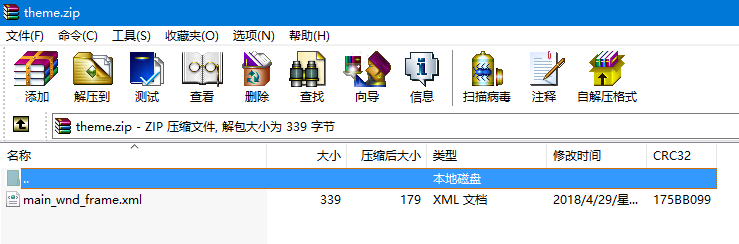
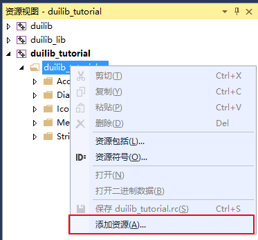
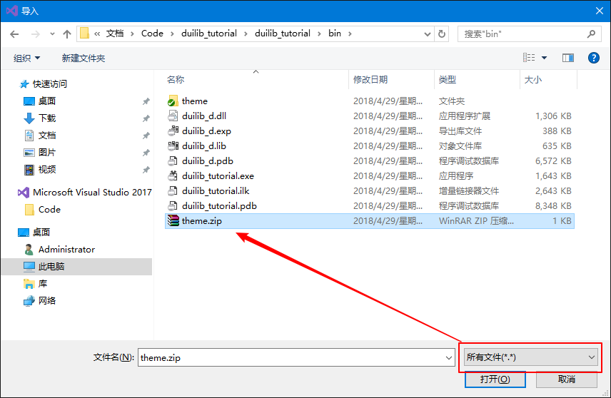
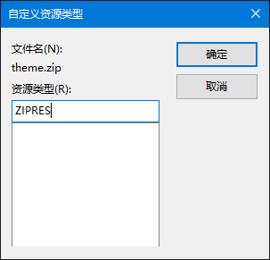
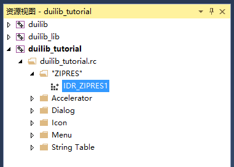
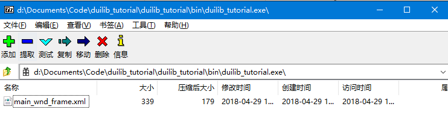

# 资源压缩打包

现在市面上有很多基于 DuiLib 开发的程序，又或者是从 DuiLib 基础上延伸出来所开发的程序。不同的程序有不同的打包资源的方式，主要有以下几种。

 - 资源存放在文件夹中
 - 资源存放在 ZIP 压缩包中
 - 资源打包到 EXE 中
 - 使用 DLL 文件存放资源

有的使用的就是执行程序目录下的文件夹，而有的使用的是一个压缩包（有可能加密），还有的就是一个单独的执行文件复制到任意位置运行同样可以有绚丽的界面。还有就是封装到一个 DLL 资源中，这种方式我也没有用到过，后面研究一下再做补充。第一种方式我们已经知道了，本章就介绍后面两种打包方式，一种是使用压缩包，一种是打包资源到执行文件中让一个文件横扫天下。


## 使用压缩包

使用压缩包的好处是资源被压缩到一个 ZIP 格式的包里面，可以减少一部分程序的体积，并且可以实现加密（本文不涉及）防止篡改，压缩包方式比较简单，修改 main 函数中将原来的

```
CPaintManagerUI::SetResourcePath(_T("theme"));
```

替换为

```
CPaintManagerUI::SetResourcePath(CPaintManagerUI::GetInstancePath());
CPaintManagerUI::SetResourceZip(_T("theme.zip"));
```

然后将我们主题文件夹中的 `main_wnd_frame.xml` 打包成一个 ZIP 文件。这里要注意，压缩包中不要再包含一个 `theme` 文件夹了，直接把 `main_wnd_frame.xml` 放在最外层就可以了。



这样我们就可以一个 EXE + 一个 ZIP 压缩包的形式发布程序了。这是其中一种方法，比较简单，还有其他的方法来实现同样的功能，类似下面即将介绍的方法，由于 DuiLib 对于资源的处置代码实现还是稍微有点小乱的。大家在实现这两种方法时候最好去实地看一下代码才知道怎么使用最适合你。

## 使用压缩包资源

与上面有什么区别呢？压缩包？资源？，其实就是把打包后的 ZIP 压缩包当作 VC 程序开发时的资源，一同打包到发布的 EXE 文件中。这样我们就仅需要发布一个 EXE 文件就可以了，而且对付一些小白还可以防止篡改资源文件。

首先删除掉 main 函数中刚才我们修改的两行代码

```
CPaintManagerUI::SetResourcePath(CPaintManagerUI::GetInstancePath());
CPaintManagerUI::SetResourceZip(_T("theme.zip"));
```

随后我们要覆写基类的两个对资源处理的函数，这两个函数分别是 `GetResourceType` 和 `GetResourceID`，前者是设置资源类型，有以下几种：

```
UILIB_FILE=1,       // 来自磁盘文件
UILIB_ZIP,          // 来自磁盘zip压缩包
UILIB_RESOURCE,     // 来自资源
UILIB_ZIPRESOURCE,  // 来自资源的zip压缩包
```

可以看到这里支持 4 种形式，包括我们之前提到的使用 ZIP 压缩包的方式，这次我们用覆写两个函数的方式来实现使用资源的 ZIP 压缩包形式。第二个函数 `GetResourceID` 就是我们要使用的资源 ID 了。首先我们要添加一个资源到项目中，资源的类型要固定为 `ZIPRES`，为什么？因为代码中写死了。我们看一下使用资源 ZIP 压缩包的内部实现代码。

```
case UILIB_ZIPRESOURCE:
	{
		HRSRC hResource = ::FindResource(m_PaintManager.GetResourceDll(), GetResourceID(), _T("ZIPRES"));
		if( hResource == NULL )
			return 0L;
		DWORD dwSize = 0;
		HGLOBAL hGlobal = ::LoadResource(m_PaintManager.GetResourceDll(), hResource);
		if( hGlobal == NULL ) 
		{
#if defined(WIN32) && !defined(UNDER_CE)
			::FreeResource(hResource);
#endif
			return 0L;
		}
		dwSize = ::SizeofResource(m_PaintManager.GetResourceDll(), hResource);
		if( dwSize == 0 )
			return 0L;
		m_lpResourceZIPBuffer = new BYTE[ dwSize ];
		if (m_lpResourceZIPBuffer != NULL)
		{
			::CopyMemory(m_lpResourceZIPBuffer, (LPBYTE)::LockResource(hGlobal), dwSize);
		}
#if defined(WIN32) && !defined(UNDER_CE)
		::FreeResource(hResource);
#endif
		m_PaintManager.SetResourceZip(m_lpResourceZIPBuffer, dwSize);
	}
	break;
```

实现方式就是查找名称为 `ZIPRES` 的资源，然后加载到内存中使用。那么我们动手开始添加吧。打开资源视图，在 EXE 的资源中右键->添加资源



然后点击 `导入` 按钮



在弹出的对话框中右下角选择所有文件，然后找到我们 EXE 目录下的 `theme.zip` 文件。然后确定，此时会让你输入资源的名称，这里我们按之前的约定输入 `ZIPRES`，然后确定。



导入完成后的样子如下



资源添加完毕了，我们得到了一个资源名为 `IDR_ZIPRES1` 的资源，此时我们开始覆写两个函数。如下所示：

```
DuiLib::UILIB_RESOURCETYPE MainWndFrame::GetResourceType() const
{
	return UILIB_ZIPRESOURCE;
}

LPCTSTR MainWndFrame::GetResourceID() const
{
	return MAKEINTRESOURCE(IDR_ZIPRES1);
}
```

此时编译一下程序，然后把编译后的 EXE 文件拿到一个空白文件夹，保证文件夹下没有你的资源文件，然后运行程序。同样程序也是可以运行的。并且如果我们用一些压缩软件打开我们的 EXE 文件（比如 7z、好压、360压缩等）你还可以看到我们的资源文件就在 EXE 里面。



到这里资源打包的几种方式我们都介绍的差不多了，有兴趣的可以自己摸索一下用资源文件而不是用资源 ZIP 压缩包的形式。
