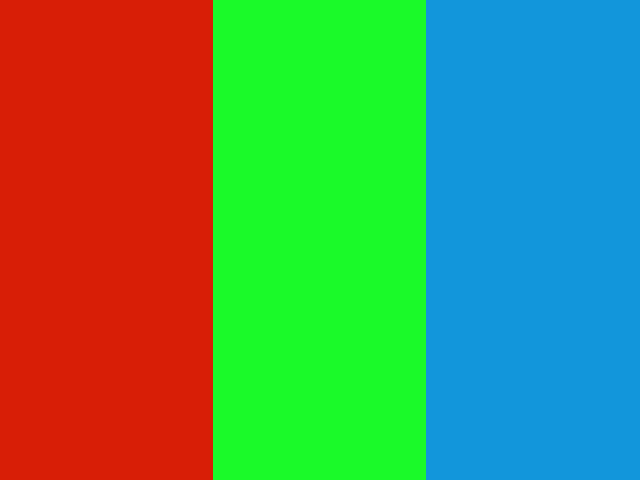
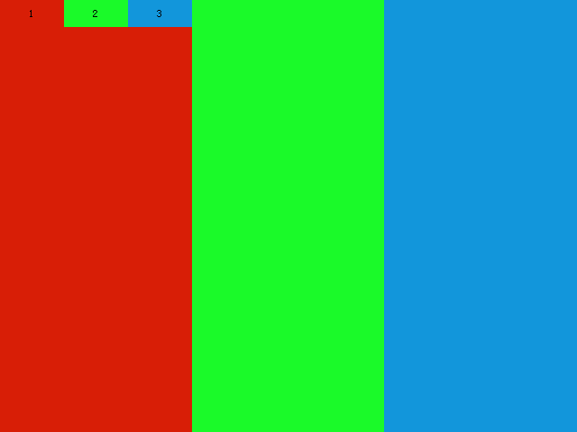
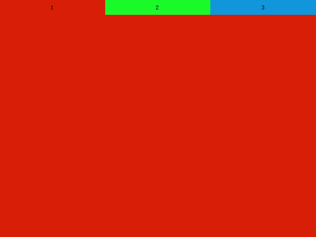
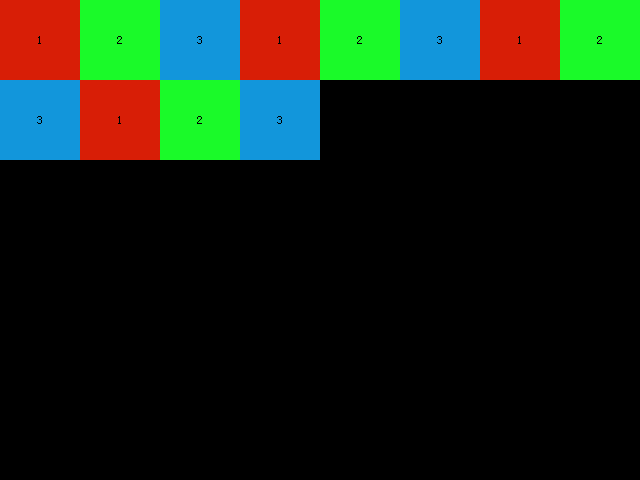
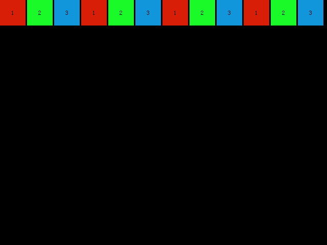
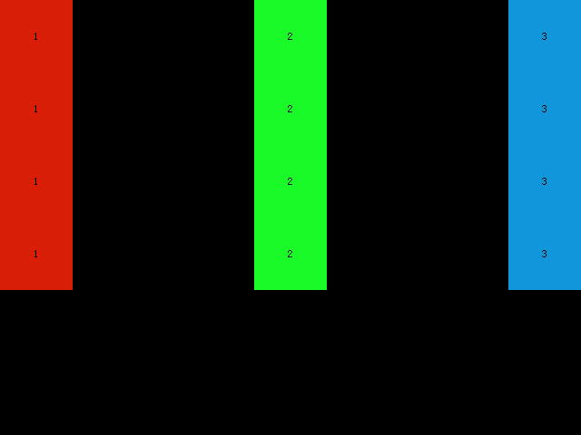

# 了解 XML 使用 （布局）

本节主要介绍 DuiLib 中 XML 关键字的使用和一些特性，通过构建一个简单的带标题栏和简单结构的窗口，目的为了了解 XML 的布局系统、基本控件和一些全局属性。在介绍之前我们先改造一下程序，让程序在 Debug 模式下使用本地的 XML 文件，只有在发布为 Release 版本时才使用打包到程序中的 ZIP 资源文件。修改 GetSkinFolder 和 GetResourceType 两个方法，如下所示。

```
DuiLib::CDuiString MainWndFrame::GetSkinFolder()
{
#if _DEBUG
	return _T("theme");
#else
	return m_PaintManager.GetInstancePath();
#endif
}
.....
.....
DuiLib::UILIB_RESOURCETYPE MainWndFrame::GetResourceType() const
{
#if _DEBUG
	return UILIB_FILE;
#else
	return UILIB_ZIPRESOURCE;
#endif
}
```

这样我们程序在 Debug 模式下使用的就是本地的 theme 文件夹内的资源了，主要是方便我们进行更新即时查看。接下来我们先从主要的几个布局开始，DuiLib 中重要的几个布局分别如下

 - HorizontalLayout 和 VerticalLayout
 - TabLayout
 - TileLayout
 - Container
 - ChildLayout

使用频率由上到下，下面我们分别介绍几种布局的特点。

## HorizontalLayout 和 VerticalLayout

DuiLib 的布局系统类似于 Qt 的布局系统， HorizontalLayout（水平布局） 和 VerticalLayout（垂直布局）来给界面划分整体区域。HorizontalLayout 顾名思义，就是让其包含的控件以水平位置排布。而 VerticalLayout 则是让起包含的控件以垂直方向进行排布。两种布局在界面中最终体现为什么样子？我们可以做一个实现来验证一下效果。但无论我们使用什么布局，最少要有一个最外部的布局。如下所示：

```
<?xml version="1.0" encoding="UTF-8"?>
<Window size="640,480" caption="0,0,0,35">
	<VerticalLayout>
		<!-- 窗口内容 -->
	</VerticalLayout>
</Window>
```

第一行是 xml 描述，这个必须要有的，不了解的同学可以搜索一些 XML 相关的介绍教程，十几分钟就看的差不多了。Window 标签也是必须要有的外部标签，size 属性决定了这个窗口的大小，caption 属性决定了这个窗口的标题栏有效范围是多大的，我们设置了 35 像素，也就是整个窗口最上方的 35 像素是可以用鼠标点击拖动的，更多的属性我们后面再来看 `属性列表.xml`，这里先不多介绍。

DuiLib 通过这个 Window 标签来识别窗口。Window 里面的 VerticalLayout 是一个最外部的布局，我们要写窗体的内部构成，都是基于这个最基本的窗体布局系统来完成的。当然你并不一定必须用 VerticalLayout 来做最外部的布局，这要看你窗口的实际布局效果。如果窗体是从左到右的水平布局模式，那你应该用 HorizontalLayout。

首先我们在这个基本的布局系统中添加三个子布局 HorizontalLayout 并设置成三种不同的颜色（通过 bkcolor 属性）来看一下效果是什么样子的。

```
<?xml version="1.0" encoding="UTF-8"?>
<Window size="640,480" caption="0,0,0,35">
	<VerticalLayout>
		<HorizontalLayout bkcolor="#FFD81E06"/>
		<HorizontalLayout bkcolor="#FF1AFA29"/>
		<HorizontalLayout bkcolor="#FF1296DB"/>
	</VerticalLayout>
</Window>
```

以上效果在程序运行后显示如下效果。


可以看出，三个 HorizontalLayout 被父控件规定为以垂直方式布局，从上到下依次排列，垂直布局不关心控件宽度，如果我们把外部的 VerticalLayout 修改为 HorizontalLayout。那么下面的三个控件应该是水平的从做到右以此排列。如下所示



如果我们在子布局中再添加一些其他的控件，我们就能看出，HorizontalLayout 下面的控件也是遵循它父级的规定来水平布局的。如下所示

```
<?xml version="1.0" encoding="UTF-8"?>
<Window size="640,480" caption="0,0,0,35">
	<HorizontalLayout>
		<HorizontalLayout bkcolor="#FFD81E06">
			<Button text="1" height="30" bkcolor="#FFD81E06" />
			<Button text="2" height="30" bkcolor="#FF1AFA29" />
			<Button text="3" height="30" bkcolor="#FF1296DB" />
		</HorizontalLayout>
		<HorizontalLayout bkcolor="#FF1AFA29"/>
		<HorizontalLayout bkcolor="#FF1296DB"/>
	</HorizontalLayout>
</Window>
```

控件的排布效果如下



这就是基本的水平和垂直布局系统的简单介绍，这两种布局是使用频率最高的了，基本上界面的布局需求都可以通过这两种布局来实现了。但是总会有个别的布局场景是需要个性化一点的，就像下面的 TabLayout。

## TabLayout

TabLayout 实现了一个 Tab 标签页方式的布局系统，其下包含的内容只能显示一个。如下所示，默认显示第一个红色的布局。

```
<?xml version="1.0" encoding="UTF-8"?>
<Window size="640,480" caption="0,0,0,35">
	<TabLayout>
		<HorizontalLayout bkcolor="#FFD81E06">
			<Button text="1" height="30" bkcolor="#FFD81E06" />
			<Button text="2" height="30" bkcolor="#FF1AFA29" />
			<Button text="3" height="30" bkcolor="#FF1296DB" />
		</HorizontalLayout>
		<HorizontalLayout bkcolor="#FF1AFA29"/>
		<HorizontalLayout bkcolor="#FF1296DB"/>
	</TabLayout>
</Window>
```



而想显示另外的两个布局，我们需要通过代码来控制。这里大家只需要有一个概念，后面我们模仿其他 Demo 的时候会用到这个布局。

## TileLayout

TileLayout 是一个块级的布局，它下面的控件都会以块为单位，像麻将一样一排一排的组合，测试代码：

```
<?xml version="1.0" encoding="UTF-8"?>
<Window size="640,480" caption="0,0,0,35">
	<TileLayout>
		<Button text="1" height="30" bkcolor="#FFD81E06" />
		<Button text="2" height="30" bkcolor="#FF1AFA29" />
		<Button text="3" height="30" bkcolor="#FF1296DB" />
		<Button text="1" height="30" bkcolor="#FFD81E06" />
		<Button text="2" height="30" bkcolor="#FF1AFA29" />
		<Button text="3" height="30" bkcolor="#FF1296DB" />
		<Button text="1" height="30" bkcolor="#FFD81E06" />
		<Button text="2" height="30" bkcolor="#FF1AFA29" />
		<Button text="3" height="30" bkcolor="#FF1296DB" />
		<Button text="1" height="30" bkcolor="#FFD81E06" />
		<Button text="2" height="30" bkcolor="#FF1AFA29" />
		<Button text="3" height="30" bkcolor="#FF1296DB" />
	</TileLayout>
</Window>
```

效果如下



TileLayout 有两个比较关键的属性，`itemsize` 和 `columns`，两者不能同时使用。前者决定 TileLayout 包含的子控件以多大尺寸来排列，后者决定了 TileLayout 有几列数据，我们先将 itemsize 指定为 "50,50"，就是告诉 TileLayout 让子控件以宽度和高度分别 50 的大小来进行排列。效果如下



如果我们指定了 `columns` 为 3，那么行只有 3 列数据。



## Container

Container 本来是所有 Layout 的基类，之所以没提前介绍它主要是它使用的场景比较少，它下面的子空间都是默认扩充整个容器的，这也就会导致所有子控件重叠在一起，除非你想实现这种效果，否则可能真的用不到它。

## ChildLayout

ChildLayout 我基本没有用过，看过官方的一些例子和 Redrain 介绍，它的功能类似于 include 一个 XML。主要功能就是有些 XML 文件因为规划不合理代码写的又臭又长，使用这个布局可以将外部的 XML 引入到本 XML 文件中，指定它的 xmlfile 属性就可以了。
