# 了解 XML 使用 （布局控制）

通过上一篇的学习我们可以制作一个简单的布局了，但是没有控件的窗口做再好的布局有什么用呀。赶紧找些素材，我们来做一个标准的 Windows 窗口。并通过这个窗口我们来了解一下布局中一些细微细节的控制。

一个常规的 Windows 窗口应该有一个像样的标题栏，标题栏左侧包含窗口的 Logo 和窗口的名称，右侧有最小化、最大化和关闭按钮，还有一些窗口可能会有设置啊等等类似的按钮。我们到网络上找一些素材，亲自动手制作一个窗口。素材我们可以到 [Iconfont-阿里巴巴矢量图标库](http://www.iconfont.cn) 去自己下载。通过搜索功能搜索一个你喜欢的图片，比如我搜索一个 Logo，会出来很多可用的图形，随便点击一个进去后，可以设置图形的颜色：


我下载了一个 PNG 小图片，大小是 18x18 像素，蓝色。将图片保存到项目的 theme 文件夹下。

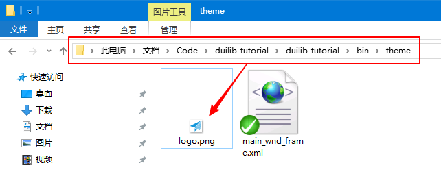

然后我们编辑 main_wnd_frame.xml，删除掉原来的 TileLayout 中所有内容，重新做一个布局，如下所示：

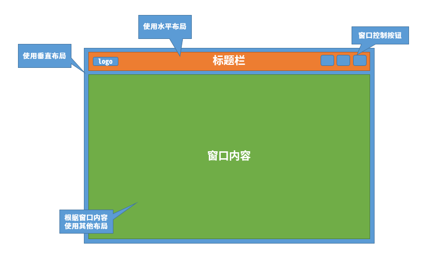

通过分析我们可以判断，最外部应该使用一个垂直布局 `VerticalLayout`，因为标题栏和下面窗口内容区域是一个从上到下的垂直布局。而标题栏里面是从左到右的一个水平布局 `VerticalLayout`。至于下方内容区域，我们暂时先不用关心，先把这个标题栏做好，所以我们还是使用一个水平布局。那么根据思路你可以先不看下面代码，自己试着写一个窗口的布局，算是对自己的一个锻炼。记得标题栏是有固定高度的，可以通过 `height` 属性指定 `HorizontalLayout` 的高度。

```
<?xml version="1.0" encoding="UTF-8"?>
<Window size="640,480" caption="0,0,0,35">
	<VerticalLayout>
		<!-- 标题栏 -->
		<HorizontalLayout height="35" bkcolor="#FFD6DBE9">
			<Control bkimage="Logo.png" height="18" width="18"/>
			<Label text="duilib tutorial" />
		</HorizontalLayout>
		<!-- 窗口内容区域 -->
		<HorizontalLayout bkcolor="#FF4D6082">
		</HorizontalLayout>
	</VerticalLayout>
</Window>
```

以上代码运行后，效果如下：

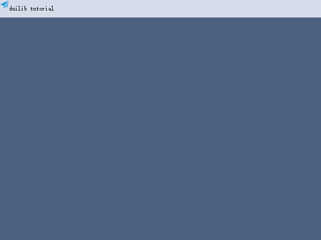

可以看到，我们给窗口分割了两个区域，一个标题栏，一个窗口内容区域，内容区域现在还没有任何内容。但是标题栏已经增加了一个 Logo。其中标题栏我们用水平布局 `HorizontalLayout` 来实现，用 `height="35"` 指定了标题栏的高度，用 `bkcolor` 属性指定了标题栏的背景色。接着标题栏内部我们使用 `Control` 控件包装的 Logo 图像，使用 `bkimage="Logo.png"` 指定了图片文件的位置，并同样使用 `height`、`width` 设置了宽度和高度。这些属性在 DuiLib 属性列表.xml 中都是可以找到的。大家可以翻一番。

但是大家可能发现了，Logo 的位置不是很好，他仅仅的挨在窗口的左上角，我们应该调整一下它的位置，让它居中显示。不过很不幸 DuiLib 好像并没有居中功能，想实现居中功能要通过布局来功能来实现，代码远远比指定一个属性要多的多。我们不通过布局方法实现难道就没有方法了吗？

## 内外边距

标题栏高度是 35，而 Logo 的高度是 18，我们让 Logo 图像的上方和左侧分别向下和向右移动 7~9 像素，这样 Logo 就可以居中显示了。通过 padding 属性可以指定容器的外边距，这里要注意，不像 Web 前端一样使用的是 `margin`，刚切换过来的朋友可能容易出错，所以要尤其注意。我们通过指定 padding="8,8,0,0" 的方式，指定了 Logo 文件左边和上边分别有 4 个像素的边距，代码如下：

```
.....
<Control bkimage="Logo.png" height="18" width="18" padding="8,8,0,0"/>
.....
```

此时再看一下效果基本上是上下居中显示了，而且左侧也与边缘有了写距离，看上去好看一些了。要注意，`padding` 的 4 个参数顺序分别是 左、上、右、下。与 Web 前端 CSS 还不一样，所以大家千万不要弄混了。

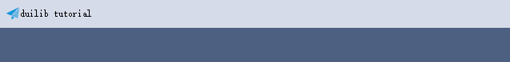

再注意 Logo 和标题文字是不是挨的有点近？那么我们再给 Logo 指定一个右侧的边距，让标题“离她远点”。

```
.....
<Control bkimage="Logo.png" height="18" width="18" padding="8,8,8,0"/>
.....
```

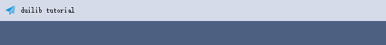

可以看到通过 padding 的设置我们可以实现让容器具有外边距效果，同样有外边距也会有内边距，我们设置标题栏容器的内边距同样可以实现让内容居中的方法。内容如下：

```
<!-- 标题栏 -->
<HorizontalLayout height="35" bkcolor="#FFD6DBE9" inset="8,8,8,0">
	<Control bkimage="Logo.png" height="18" width="18" />
	<Label text="duilib tutorial" height="18" padding="8"/>
</HorizontalLayout>
```

我们使用 `inset` 属性给外部的水平布局容器设置了左侧、上方、右侧分别 8 个像素的内边距，由于 Label 默认是填满整个容器的，所以我们要给他设置一个高度，否则会被挤下来，而且我们删除掉了 Logo 的 `padding` 属性，Logo 与标题之间的间距也不在了。所以这次换个方式，我们给标题文字指定了一个 `padding="8"` 的属性，你会发现，如果我们不需要指定上、右、下的其他几个属性，我们仅指定填写第一个左侧的数据就可以了。这样可以让代码比较简练。效果如下：

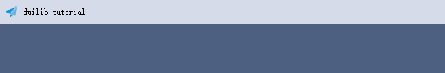

## 浮动

除了上面的内外边距可以实现这个效果以外，我们还可以通过让控件 `浮动起来` 的方式，通过指定一个 pos 属性让它想在哪里就在哪里。但前提是你要通过 float 属性指定控件是一个浮动的控件。代码如下：

```
<!-- 标题栏 -->
<HorizontalLayout height="35" bkcolor="#FFD6DBE9">
	<Control bkimage="logo.png" height="18" width="18" float="true" pos="8,8,26,26" />
	<Label text="duilib tutorial" height="18" float="true" pos="35,8,185,26"/>
</HorizontalLayout>
```

去掉了外部水平布局容器的内边距后，我们让 `Control` 控件和 `Label` 控件都成为浮动控件，并指定他们的具体坐标。注意 pos 的第三个和第四个参数，他们决定了控件的右上角位置和右下角位置。要算上控件本身的大小，比如例子中的 Label 控件第三个参数 185，是算上了控件左侧的 35 + 控件自身宽度的总和，如下图所示：

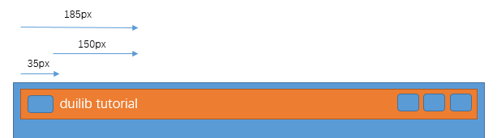

这种方式虽然能实现功能，但是代码写起来繁琐，不容易维护，要调整一个位置要修改好多地方，非常容易出错。所以除非必要，还是建议大家少用这个浮动的功能。

接下来我们来把右侧的几个功能按钮也做一下，我们还是去找一下素材。在 [Iconfont-阿里巴巴矢量图标库](http://www.iconfont.cn/collections/detail?cid=618) 搜索 min、max、close 等关键字就可以搜索到相关素材。在找素材的时候大家请注意，由于我们按钮需要三种状态的图片，一个是普通样式的，一个是鼠标悬浮状态的图片，一个是鼠标按下时的效果，三种效果我们都要找，为了区别不同效果，我使用了不同的颜色。你们也可以根据自己的需要设置不同的颜色，我分别给普通、悬浮状态和按下状态的图片命名为 `btn_*_normal.png`、`btn_*_hovered.png`、`btn_*_pushed.png`，如下图：

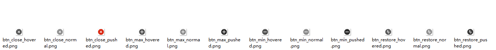

由于实在没有找到还原窗口的合适图片，所以临时找个了带了两个箭头的图片顶替了（论身边有个视觉是多么美妙的事情），4 种按钮默认只显示最小化、最大化和关闭，还原按钮只有在最大化的情况下才显示，所以默认我们让他不显示，最终代码如下：

```
<?xml version="1.0" encoding="UTF-8"?>
<Window size="640,480" caption="0,0,0,35">
	<VerticalLayout>
		<!-- 标题栏 -->
		<HorizontalLayout height="35" bkcolor="#FFD6DBE9" inset="8,8,8,0">
			<Control bkimage="logo.png" height="18" width="18" />
			<Label text="duilib tutorial" height="18" padding="8"/>
			<HorizontalLayout childpadding="3" width="60">
				<Button height="18" width="18" normalimage="btn_min_normal.png" hotimage="btn_min_hovered.png" pushedimage="btn_min_pushed.png" />
				<Button height="18" width="18" normalimage="btn_max_normal.png" hotimage="btn_max_hovered.png" pushedimage="btn_max_pushed.png" />
				<Button height="18" width="18" normalimage="btn_restore_normal.png" hotimage="btn_restore_hovered.png" pushedimage="btn_restore_pushed.png" visible="false"/>
				<Button height="18" width="18" normalimage="btn_close_normal.png" hotimage="btn_close_hovered.png" pushedimage="btn_close_pushed.png" />
			</HorizontalLayout>
		</HorizontalLayout>
		<!-- 窗口内容区域 -->
		<HorizontalLayout bkcolor="#FF4D6082">
		</HorizontalLayout>
	</VerticalLayout>
</Window>
```

 - 使用 `childpadding` 属性指定了右侧三个按钮水平布局的子控件左右间距（如果是垂直布局那么就是上下间距）
 - 使用 `normalimage` 属性设置控件的默认图片样式
 - 使用 `hotimage` 属性设置控件的鼠标悬浮状态图片
 - 使用 `pushedimage` 属性设置鼠标按下状态图片
 - 使用 `visible` 属性设置还原控件的默认显示状态（见还原按钮的最后一个属性）

重新运行一下程序，我们可以看到三个按钮已经在右上角了。


当我们鼠标按下关闭按钮时，颜色会变为红色

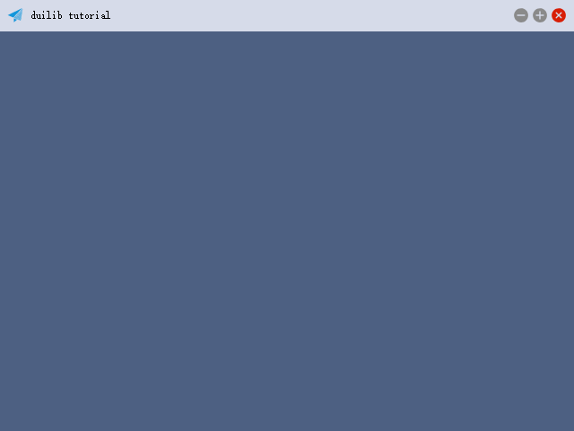

## 占位符

因为我们给右侧三个按钮的水平布局容器设置了固定宽度，并且他们左边的 Label 控件是默认拉伸占满整个容器的状态，所以三个按钮的容器默认就被 “挤” 到最右侧去了。如果左边我们也设置了一个默认宽度的容器，右侧关闭按钮也被设置为固定宽度。那么布局就不是这样了，如下所示：

```
<?xml version="1.0" encoding="UTF-8"?>
<Window size="640,480" caption="0,0,0,35">
	<VerticalLayout>
		<!-- 标题栏 -->
		<HorizontalLayout height="35" bkcolor="#FFD6DBE9" inset="8,8,8,0">
			<HorizontalLayout width="185">
				<Control bkimage="logo.png" height="18" width="18" />
				<Label text="duilib tutorial" height="18" padding="8"/>
			</HorizontalLayout>
			<HorizontalLayout childpadding="3" width="60">
				<Button height="18" width="18" normalimage="btn_min_normal.png" hotimage="btn_min_hovered.png" pushedimage="btn_min_pushed.png" />
				<Button height="18" width="18" normalimage="btn_max_normal.png" hotimage="btn_max_hovered.png" pushedimage="btn_max_pushed.png" />
				<Button height="18" width="18" normalimage="btn_restore_normal.png" hotimage="btn_restore_hovered.png" pushedimage="btn_restore_pushed.png" visible="false"/>
				<Button height="18" width="18" normalimage="btn_close_normal.png" hotimage="btn_close_hovered.png" pushedimage="btn_close_pushed.png" />
			</HorizontalLayout>
		</HorizontalLayout>
		<!-- 窗口内容区域 -->
		<HorizontalLayout bkcolor="#FF4D6082">
		</HorizontalLayout>
	</VerticalLayout>
</Window>
```

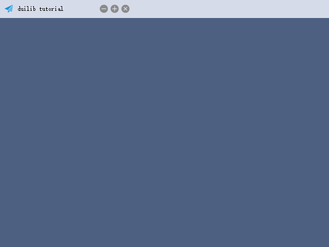

此时如果想让三个按钮靠右显示，我们可以使用 *占位符*

```
<?xml version="1.0" encoding="UTF-8"?>
<Window size="640,480" caption="0,0,0,35">
	<VerticalLayout>
		<!-- 标题栏 -->
		<HorizontalLayout height="35" bkcolor="#FFD6DBE9" inset="8,8,8,0">
			<HorizontalLayout width="185">
				<Control bkimage="logo.png" height="18" width="18" />
				<Label text="duilib tutorial" height="18" padding="8"/>
			</HorizontalLayout>
			<Control />
			<HorizontalLayout childpadding="3" width="60">
				<Button height="18" width="18" normalimage="btn_min_normal.png" hotimage="btn_min_hovered.png" pushedimage="btn_min_pushed.png" />
				<Button height="18" width="18" normalimage="btn_max_normal.png" hotimage="btn_max_hovered.png" pushedimage="btn_max_pushed.png" />
				<Button height="18" width="18" normalimage="btn_restore_normal.png" hotimage="btn_restore_hovered.png" pushedimage="btn_restore_pushed.png" visible="false"/>
				<Button height="18" width="18" normalimage="btn_close_normal.png" hotimage="btn_close_hovered.png" pushedimage="btn_close_pushed.png" />
			</HorizontalLayout>
		</HorizontalLayout>
		<!-- 窗口内容区域 -->
		<HorizontalLayout bkcolor="#FF4D6082">
		</HorizontalLayout>
	</VerticalLayout>
</Window>
```

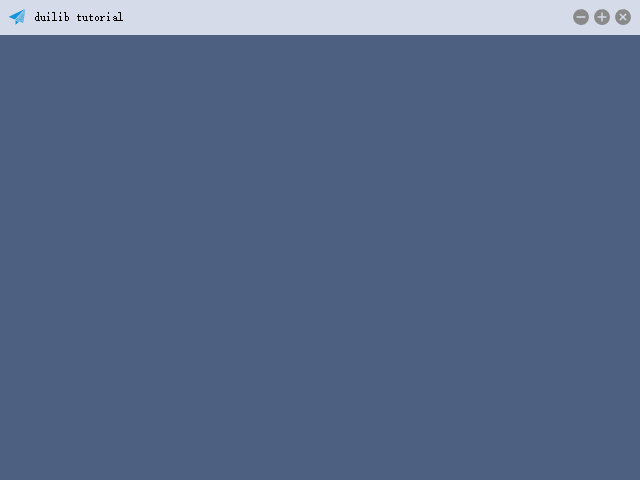

同样的代码我们只是在两个水平布局中间增加了一个空的 Control 控件，它会根据父容器的宽度无限拉伸，由于两侧的两个水平布局容器已经设置了固定宽度，那么它会 “野蛮” 的把剩下所有控件都占掉。这就是所谓的 *占位符*。如果你需要实现一个紧贴顶部和紧贴底部的容器，那么你可以使用垂直布局方式，中间同样增加一个占位符来实现需求。

到这里我们已经基本上把所有布局相关的内容都说的差不多了，如果还有更重要的内容我会一点点在补充。大家发现，除了之前我们构建窗口时写了一部分代码，剩下的内容都是我们通过 XML 来实现的，并没有敲一行多余的代码。这就是 DuiLib，界面和业务有很大的分离性。接下来我们该看看怎么响应按钮的点击事件了。

## 默认样式

DuiLib 在 XML 语法中提供了一些默认样式功能，我们可以给指定控件预设一些默认的样式，当创建这种控件的时候，默认样式就会在其上面展现。比如我们希望所有按钮都有一个边框。那么可以像下面这样来编写 XML

```
<?xml version="1.0" encoding="UTF-8"?>
<Window size="640,480" caption="0,0,0,35">
	<Default name="Button" value="bordersize=&quot;1&quot; bordercolor=&quot;#FF222222&quot;" />
	<VerticalLayout>
		<!-- 标题栏 -->
		<HorizontalLayout height="35" bkcolor="#FFD6DBE9" inset="8,8,8,0">
			<HorizontalLayout width="185">
				<Control bkimage="logo.png" height="18" width="18" />
				<Label text="duilib tutorial" height="18" padding="8"/>
			</HorizontalLayout>
			<Control />
			<HorizontalLayout childpadding="3" width="60">
				<Button name="minbtn" height="18" width="18" normalimage="btn_min_normal.png" hotimage="btn_min_hovered.png" pushedimage="btn_min_pushed.png" />
				<Button name="maxbtn" height="18" width="18" normalimage="btn_max_normal.png" hotimage="btn_max_hovered.png" pushedimage="btn_max_pushed.png" />
				<Button name="restorebtn" height="18" width="18" normalimage="btn_restore_normal.png" hotimage="btn_restore_hovered.png" pushedimage="btn_restore_pushed.png" visible="false"/>
				<Button name="closebtn" height="18" width="18" normalimage="btn_close_normal.png" hotimage="btn_close_hovered.png" pushedimage="btn_close_pushed.png" />
			</HorizontalLayout>
		</HorizontalLayout>
		<!-- 窗口内容区域 -->
		<HorizontalLayout bkcolor="#FF4D6082">
		</HorizontalLayout>
	</VerticalLayout>
</Window>
```

我们增加了一行

```
<Default name="Button" value="bordersize=&quot;1&quot; bordercolor=&quot;#FF222222&quot;" />
```

设置其 name 属性为 “Button”，value 属性为样式描述，因为是作为 XML 的值来使用，所以双引号等要做一下转义。这也操作后，所有按钮都具备了 `"bordersize="1" bordercolor="#FF222222"`  两个属性。如下所示：


## 全局字体

像默认属性一样，全局字体也是可以让多个控件使用的一个属性，不过控件可以决定是否使用这个属性，而上面介绍的默认属性是强制的。使用方法如下：

```
<?xml version="1.0" encoding="UTF-8"?>
<Window size="640,480" caption="0,0,0,35">
	<Font shared="true" id="1" name="微软雅黑" size="18" />
	<VerticalLayout>
		<!-- 标题栏 -->
		<HorizontalLayout height="35" bkcolor="#FFD6DBE9" inset="8,8,8,0">
			<HorizontalLayout width="185">
				<Control bkimage="logo.png" height="18" width="18" />
				<Label text="duilib tutorial" height="18" padding="8" font="1"/>
			</HorizontalLayout>
			<Control />
			<HorizontalLayout childpadding="3" width="60">
				<Button name="minbtn" height="18" width="18" normalimage="btn_min_normal.png" hotimage="btn_min_hovered.png" pushedimage="btn_min_pushed.png" />
				<Button name="maxbtn" height="18" width="18" normalimage="btn_max_normal.png" hotimage="btn_max_hovered.png" pushedimage="btn_max_pushed.png" />
				<Button name="restorebtn" height="18" width="18" normalimage="btn_restore_normal.png" hotimage="btn_restore_hovered.png" pushedimage="btn_restore_pushed.png" visible="false"/>
				<Button name="closebtn" height="18" width="18" normalimage="btn_close_normal.png" hotimage="btn_close_hovered.png" pushedimage="btn_close_pushed.png" />
			</HorizontalLayout>
		</HorizontalLayout>
		<!-- 窗口内容区域 -->
		<HorizontalLayout bkcolor="#FF4D6082">
		</HorizontalLayout>
	</VerticalLayout>
</Window>
```

我们添加了一行 

```
<Font shared="true" id="1" name="微软雅黑" size="18" />
```

并在标题的 Label 中增加了一个 `Font="1"` 的属性，用意就是让这个 Label 使用 Font 编号为 1 的字体。而 Font 通过 id 属性指定了编号。这样再运行程序后，窗体标题就变成了微软雅黑 18 大小的字体。

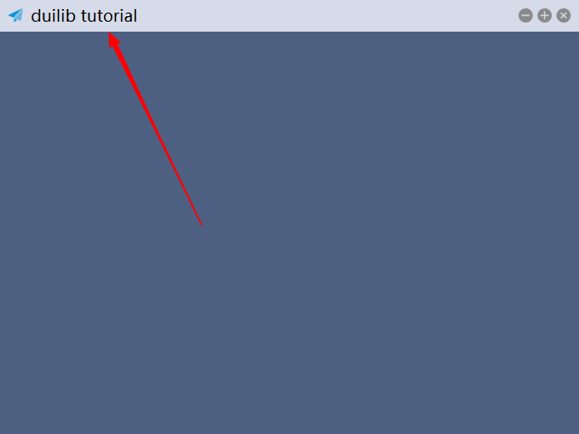

Font 有如下属性可以使用

 - name：字体名称
 - size：字体大小
 - bold：粗体
 - italic：斜体
 - underline：下划线
 - id：字体的编号
 - shared：是否共享
