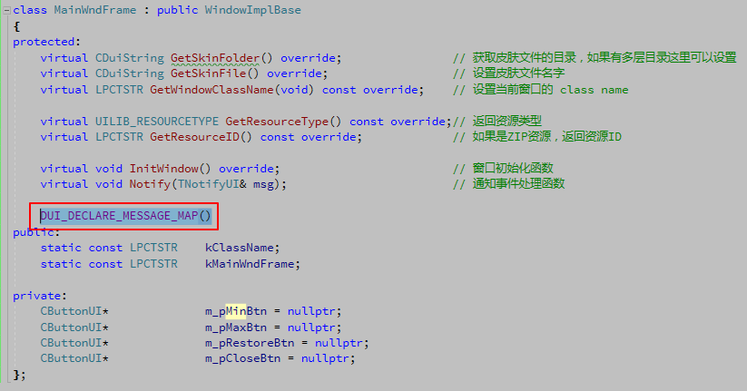
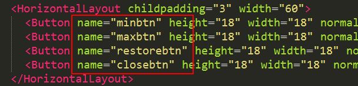
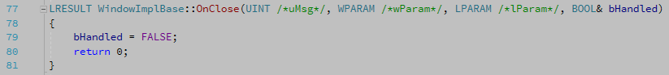

# 控件消息响应处理

上一篇我们介绍了如何通过命名的 XML 控件转化为实际可操控的对象，实际上我们已经可以调用这些控件的一些方法来操作控件了，比如

```
void MainWndFrame::InitWindow()
{
	m_pMinBtn = dynamic_cast<CButtonUI*>(m_PaintManager.FindControl(_T("btn_wnd_min")));
	m_pMaxBtn = dynamic_cast<CButtonUI*>(m_PaintManager.FindControl(_T("btn_wnd_max")));
	m_pRestoreBtn = dynamic_cast<CButtonUI*>(m_PaintManager.FindControl(_T("btn_wnd_restore")));
	m_pCloseBtn = dynamic_cast<CButtonUI*>(m_PaintManager.FindControl(_T("btn_wnd_close")));

	m_pMinBtn->SetVisible(false);
}
```

我们调用了 CButtonUI 的 SetVisible 方法，将最小化控件隐藏了。但实际这并没有什么作用，我们真正需要的是点击某个控件后执行某些操作。


## 基本的消息响应处理

接下来我们希望实现更实用的功能，点击最小化按钮把窗口最小化、点击关闭按钮把窗口关闭等。这就要涉及到对控件消息的处理，同样父类 `WindowImplBase` 提供了 `Notify` 虚函数，可以提供我们覆写并处理消息。一下代码实现了点击最小化按钮将窗口最小化的功能。

```
void MainWndFrame::Notify(TNotifyUI& msg)
{
	if (msg.sType == DUI_MSGTYPE_CLICK)
	{
		CDuiString strName = msg.pSender->GetName();
		if (strName == _T("btn_wnd_min"))
		{
			SendMessage(WM_SYSCOMMAND, SC_MINIMIZE, 0);
		}
	}

	__super::Notify(msg);
}
```

首先我们在 `Notify` 函数中判断了一下消息的类型，如果是鼠标点击那么我们获取一下触发的控件名称，根据名称判断是不是 `btn_wnd_min` 然后执行指定操作。最后别忘记调用父类的 Notify 函数来继续其他消息的处理（其实父类什么都没做，）。

## 仿 MFC 形式消息响应

以上是一个基本的响应过程。另外还有一种类似 MFC 方式的响应方法，首先在 MainWndFrame.h 中添加一句 `DUI_DECLARE_MESSAGE_MAP()`



然后在 MainWndFrame.cpp 中添加如下代码

```
DUI_BEGIN_MESSAGE_MAP(MainWndFrame, CNotifyPump)
	DUI_ON_MSGTYPE(DUI_MSGTYPE_CLICK, OnClick)
DUI_END_MESSAGE_MAP()
```

这样我们就将 DUI_MSGTYPE_CLICK 类型的消息映射到了 OnClick 函数中，而 OnClick 函数在父类 WindowImplBase 中已经提供了一个虚函数了。

```
void WindowImplBase::OnClick(TNotifyUI& msg)
{
	CDuiString sCtrlName = msg.pSender->GetName();
	if( sCtrlName == _T("closebtn") )
	{
		Close();
		return; 
	}
	else if( sCtrlName == _T("minbtn"))
	{ 
		SendMessage(WM_SYSCOMMAND, SC_MINIMIZE, 0); 
		return; 
	}
	else if( sCtrlName == _T("maxbtn"))
	{ 
		SendMessage(WM_SYSCOMMAND, SC_MAXIMIZE, 0); 
		return; 
	}
	else if( sCtrlName == _T("restorebtn"))
	{ 
		SendMessage(WM_SYSCOMMAND, SC_RESTORE, 0); 
		return; 
	}
	return;
}
```
可以看出，DuiLib 已经默认帮我们实现了几个按钮的鼠标点击功能。我们只需要根据它设定的名字修改一下我们控件的 name 属性就可以实现几个功能了。当然如果我们要添加其他控件的处理，是需要覆写这个 OnClick 函数的。



修改完成后最小化、最大化、还原三个按钮都可以正常工作了，但是关闭按钮点击后并不能完全退出程序，而仅仅是把程序隐藏了，这主要原因是当我们点击关闭按钮时调用的是父类的 Close 函数，该函数发送了退出消息后，窗口接收到该消息的处理函数 OnClose 未做任何措施，如下所示：



要解决这个问题很简单，我们只需要覆写一下这个 OnClose 方法，然后执行退出操作就可以了。

```
LRESULT MainWndFrame::OnClose(UINT uMsg, WPARAM wParam, LPARAM lParam, BOOL& bHandled)
{
	if (uMsg == WM_CLOSE)
	{
		PostQuitMessage(0L);
	}

	return __super::OnClose(uMsg, wParam, lParam, bHandled);
}
```
覆写完成后，我们三个功能按钮（哦不，是四个）就都可以正常使用了。另外我自己还发现了一个小问题，窗口的标题栏双击是无法最大化的，这个解决很简单，在 main 函数创建窗口的时候，将窗口的 `UI_WNDSTYLE_DIALOG` 属性修改为 `UI_WNDSTYLE_FRAME` 就可以了，至于两个参数什么意思，大家跟进去看一下就知道拉。

```
pMainWndFrame->Create(nullptr, MainWndFrame::kClassName, UI_WNDSTYLE_FRAME, 0);
```

## 事件委托

除了以上两种方式外，我们还可以通过事件委托的方式来处理指定控件的消息。如下示例演示了事件委托的实现方式。

```
void MainWndFrame::InitWindow()
{
	m_pMinBtn = dynamic_cast<CButtonUI*>(m_PaintManager.FindControl(_T("minbtn")));
	m_pMaxBtn = dynamic_cast<CButtonUI*>(m_PaintManager.FindControl(_T("maxbtn")));
	m_pRestoreBtn = dynamic_cast<CButtonUI*>(m_PaintManager.FindControl(_T("restorebtn")));
	m_pCloseBtn = dynamic_cast<CButtonUI*>(m_PaintManager.FindControl(_T("closebtn")));

	m_pMinBtn->OnNotify += MakeDelegate(this, &MainWndFrame::OnBtnTest);
}
```

在 InitWindow 函数中，我们给最小化按钮委托了一个 OnBtnTest 的处理函数，当我们对最小化按钮做某些操作时，就会到达 OnBtnTest 处理函数中。OnBtnTest 的实现如下：

```
bool MainWndFrame::OnBtnTest(void* param)
{
	TNotifyUI* msg = reinterpret_cast<TNotifyUI*>(param);
	if (msg->sType == DUI_MSGTYPE_CLICK)
	{
		// ... do something
	}

	return true;
}
```

这种方式同样可以实现处理控件的消息功能，如果对委托的函数指针加以改造，还可以使用 C++11 的 lambda 表达式来实现具体的处理函数功能。

## 消息捕获（拦截）原生消息

DuiLib 提供了虚函数 `HandleMessage`，可以提供我们覆写来捕获或者拦截原声的系统消息。比如我们希望监听剪切板的消息时，就可以像一下方法一样来实现。

```
LRESULT MainWndFrame::HandleMessage(UINT uMsg, WPARAM wParam, LPARAM lParam)
{
	if (uMsg == WM_CHANGECBCHAIN)
	{
		// do something...
	}
	else if (uMsg == WM_DRAWCLIPBOARD)
	{
		// do something...
	}

	return __super::HandleMessage(uMsg, wParam, lParam);
}
```

老版本的 DuiLib 中窗口创建完成后，按下 ESC 窗口会被关闭，如果想屏蔽掉 ESC 按下的消息，就可以通过这个函数来实现。
