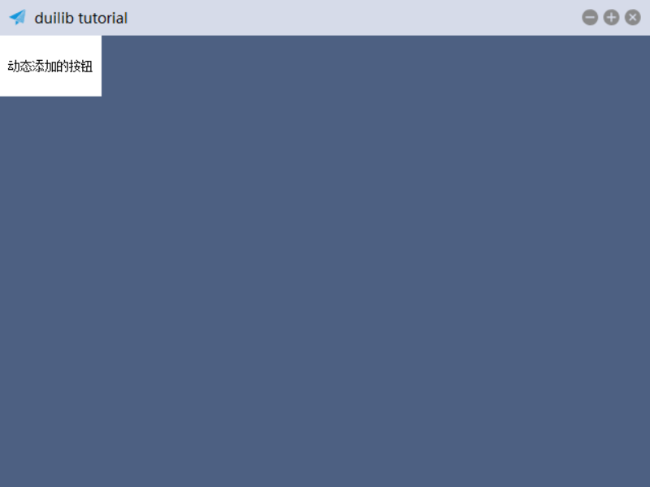
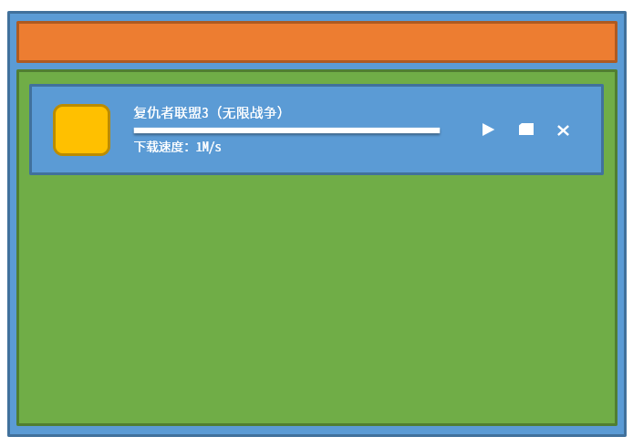
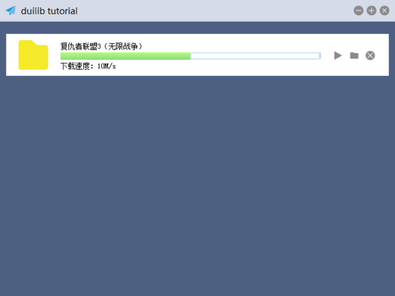

# 动态创建控件

在实际业务场景中，并不是所有界面元素都可以通过 XML 预先定义好的，有时候我们需要根据数据库或者服务器返回的数据动态的在界面上创建一些控件。本文将介绍两种方式来动态创建控件的方法，一种是使用纯代码方式，另外一种是使用已经构建好的 XML 来动态创建控件。

## 纯代码方式动态创建控件

之前创建控件的方式都是在 XML 写好，设置好显示位置，运行程序后就自动显示出来了。实际一个控件对应的就是 DuiLib 中的一个类，我们只需要在代码中实例化一个控件类对象，设置好显示位置和控件的样式，并插入到指定的容器内就可以显示出来了。假设我们要在窗口内容区域插入一个按钮，那么首先要给窗口内容区域一个可识别的名称，我们要将窗口内容区域转化为可用的控件对象然后给它添加子控件。

```
<!-- 窗口内容区域 -->
<HorizontalLayout name="main_wnd_content" bkcolor="#FF4D6082">
</HorizontalLayout>
```

我们给内容区域的水平布局控件添加了一个 name 属性，并指定为 `main_wnd_content`，随后在 InitWindow 方法中，我们全新实例化一个按钮控件，给这个内容区域的容器插入进去。

```
void MainWndFrame::InitWindow()
{
	// ..... 其他代码

	m_pMainWndContent = dynamic_cast<CHorizontalLayoutUI*>(m_PaintManager.FindControl(_T("main_wnd_content")));

	CButtonUI* btn = new CButtonUI;
	btn->SetText(_T("动态添加的按钮"));
	btn->SetBkColor(0xFFFFFFFF);
	btn->SetFixedHeight(60);
	btn->SetFixedWidth(100);

	m_pMainWndContent->Add(btn);
}
```

使用 m_PaintManager 的 FindControl 方法查找到了窗口内容区域的容器，然后将其转化为可用的控件对象，随后调用了它的 Add 方法，将 new 出来的 CButtonUI 对象添加到容器中。这样就运行程序，就可以看到通过代码动态添加的控件了。



大家也注意到了，在 new 出这个新的 CButtonUI 对象后，我们调用了它的一系列修改控件状态的属性，修改了一下控件的外观和样式，才插入到容器中。如果这个样式比较复杂，代码可能要写很多，而且有些内容是需要随着视觉或者交互设计来变化的，这种情况下，我们可以把这个控件的样子单独写成一个 XML 模版文件，在创建控件的时候根据 XML 的模版来创建控件，就不需要在代码中写死那么多固定的样式了，后期修改也非常方便。

## 基于构建好的 XML 动态创建控件（CDialogBuilder）

为了让示例更加生动有意义，我们仿照迅雷的下载任务列表。示例将创建一个列表，并在列表中插入我们自己自定义样式的控件，这个控件的样子写在 XML 中，代码通过动态创建控件的方式从 XML 中读取样式显示到程序界面上。大致的图形效果如下：



每一个下载任务我们把它归纳为一个整体的容器，这个容器中包含了任务图片、名称、进度、下载速度和右侧的控制按钮。详细分析一下这个容器中，可以总体分为三个部分，一个是图片、一个是任务进度和描述，一个是任务控制按钮。下面我们单独创建一个 XML 文件命名为 `list_item.xml`，来描述这个任务容器。

```
<?xml version="1.0" encoding="UTF-8"?>
<Window>
	<ListContainerElement inset="20,10,20,10" height="68" bkcolor="#FFFFFFFF" padding="0,10,0,0">
		<HorizontalLayout>
			<Control bkimage="folder.png" width="48" height="48" padding="0,0,20,0"/>
			<VerticalLayout inset="0,0,20,0">
				<Label name="item_title" text="复仇者联盟3（无限战争）" />
				<Progress min="0" max="100" value="50" height="12" bkimage="progress_back.png" foreimage="progress_fore.png" />
				<Label name="item_tip" text="下载速度：10M/s" />
			</VerticalLayout>
			<HorizontalLayout childpadding="10" width="70" inset="0,17">
				<Button width="16" height="16" name="btn_start" normalimage="btn_start_normal.png" hotimage="btn_start_hovered.ong" pushedimage="btn_start_pushed.png" />
				<Button width="16" height="16" name="btn_folder" normalimage="btn_folder_normal.png" hotimage="btn_folder_hovered.ong" pushedimage="btn_folder_pushed.png" />
				<Button width="16" height="16" name="btn_delete" normalimage="btn_delete_normal.png" hotimage="btn_delete_hovered.ong" pushedimage="btn_delete_pushed.png" />
			</HorizontalLayout>
		</HorizontalLayout>
	</ListContainerElement>
</Window>
```

 - 图片使用了 Control 控件来实现，设置其背景为 folder.png 当作下载任务的图片
 - 使用了一个垂直布局容纳了下载任务名称、进度条和下载速度
 - 使用了一个水平布局容纳了右侧的三个控制按钮，并给他们设置间距为 10
 - 按钮也设置了悬浮、按下的图片效果（各个图片素材均会随本次提交到 github 中）

单个列表的 Item 制作好了，还要在窗体内容部分增加一个 List，来准备容纳这些 Item。

```
...
<!-- 窗口内容区域 -->
<HorizontalLayout bkcolor="#FF4D6082">
  <List name="main_wnd_list" header="hidden" padding="10,10,10,10" />
</HorizontalLayout>
...
```

其中 `header="hidden"` 设置不显示列表头，`padding="10,10,10,10"` 设置了 List 与父容器之间的边距。接下来代码中就要得到这个 List 的句柄，首先要在 MainWndFrame 类中增加一个 CListUI 的成员变量，然后在 InitWindow 中给它赋值。随后我们创建一个 CDialogBuilder 对象，使用其 Create 方法根据 XML 文件来构建一个控件，最后插入到 CListUI 中。代码如下：

void MainWndFrame::InitWindow()
{
	//.....
	m_pMainWndList = dynamic_cast<CListUI*>(m_PaintManager.FindControl(_T("main_wnd_list")));

	CDialogBuilder builder;
	CControlUI* pControl = builder.Create(_T("list_item.xml"), (UINT)0, this, &m_PaintManager);
	m_pMainWndList->Add(pControl);
}

这里你可以把 CDialogBuilder 的对象作为成员变量，但每次插入数据前你需要使用 CDialogBuilder 的 `GetMarkup()->IsValid()` 方法，来判断当前是否已经装载了一个 XML，如果装载了那么直接调用他的另一个 Create 重载方法即可构建一个控件，这样可以提高效率。类似如下代码演示:

```
CControlUI* pControl = nullptr;
if (m_pBuilder.GetMarkup()->IsValid())
{
	pControl = m_pBuilder.Create(this, &m_PaintManager);
}
else
{
	pControl = m_pBuilder.Create(_T("list_item.xml"), (UINT)0, this, &m_PaintManager);
}
m_pMainWndList->Add(pControl);
```

所有素材和 XML 都准备完成后，编译代码可得到如下效果：



到这里你可能发现了，如果列表中有一个 Item 还好，如果有几十个上百个，他们每个 Item 的消息响应就成了问题。其实这个问题是设计问题，与 DuiLib 没什么关系，你完全可以自己新建一个类，继承 CListContainerElementUI 让每个 Item 都是一个单独的对象，消息响应转义到每个单独对象中，这样就不会混乱了。这个课题就留给大家自己研究一下吧。
