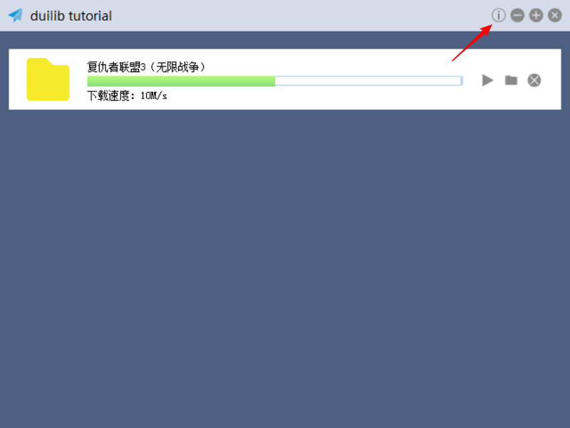

# 创建子窗口

一个大规模的应用不可能只有一个窗口，之前我们的案例都是在一个窗口实现的，接下来我们实现一个关于窗口，来介绍如何通过 DuiLib 实现子窗口管理。

## 创建子窗口 XML 配置文件

前面我们已经做了很多 XML 的案例了，所以这里就不多说了，直接将写好的 XML 贴上来给大家做一下简单分析，然后直接使用。

```
<?xml version="1.0" encoding="UTF-8"?>
<Window size="480,360" caption="0,0,0,35">
	<Font shared="true" id="1" name="微软雅黑" size="14" />
	<VerticalLayout>
		<!-- 标题栏 -->
		<HorizontalLayout height="35" bkcolor="#FFD6DBE9" inset="8,8,8,0">
			<HorizontalLayout width="185">
				<Control bkimage="logo.png" height="18" width="18" />
				<Label text="关于" height="18" padding="8" font="1"/>
			</HorizontalLayout>
			<Control />
			<HorizontalLayout width="18">
				<Button name="btn_close" height="18" width="18" normalimage="btn_close_normal.png" hotimage="btn_close_hovered.png" pushedimage="btn_close_pushed.png" />
			</HorizontalLayout>
		</HorizontalLayout>
		<HorizontalLayout bkcolor="#FFFFFFFF">
			<Label align="center" text="duilib tutorial, created by jiajia_deng" />
		</HorizontalLayout>
	</VerticalLayout>
</Window>
```

窗口还是保留标题栏，但只有一个关闭按钮了，并且关闭按钮的名字我修改成了 btn_close，目的就是不想让窗口走默认的关闭流程。窗口中只有一个 Label 显示了一串文字（毕竟这不是重点）。然后我们需要新建一个类，与 MainWndFrame 窗口一样，继承 WindowImplBase 实现各个虚函数。如下所示：

```
#pragma once
class AboutWndFrame : public WindowImplBase
{
protected:
	virtual CDuiString GetSkinFolder() override;                // 获取皮肤文件的目录，如果有多层目录这里可以设置
	virtual CDuiString GetSkinFile() override;                  // 设置皮肤文件名字
	virtual LPCTSTR GetWindowClassName(void) const override;    // 设置当前窗口的 class name

	virtual UILIB_RESOURCETYPE GetResourceType() const override;// 返回资源类型
	virtual LPCTSTR GetResourceID() const override;             // 如果是ZIP资源，返回资源ID

	virtual void InitWindow() override;                         // 窗口初始化函数
	virtual void Notify(TNotifyUI& msg) override;               // 通知事件处理函数

public:
	static const LPCTSTR	kClassName;
	static const LPCTSTR	kAboutWndFrame;

private:
	CButtonUI*				m_pCloseBtn = nullptr;
};
```

各个接口的实现我就不在这里贴代码了，大家可以看提交的 Demo 代码。随后在 main_wnd_frame.xml 中，增加一个关于按钮到最小化按钮左边。

```
<HorizontalLayout childpadding="3" width="81">
  <Button name="aboutbtn" height="18" width="18" normalimage="btn_about_normal.png" hotimage="btn_about_hovered.png" pushedimage="btn_about_pushed.png" />
  <Button name="minbtn" height="18" width="18" normalimage="btn_min_normal.png" hotimage="btn_min_hovered.png" pushedimage="btn_min_pushed.png" />
  ....
</HorizontalLayout>
```

此时主窗口就会显示一个关于按钮了，注意我们也修改了父容器的宽度，因为比之前多了一个按钮，我们要算上按钮宽度和间距增大父容器的宽度。



接下来做关于按钮的响应，首先添加一个按钮的成员变量来接收关于按钮，然后再 inlucde 关于窗口的头文件 `AboutWndFrame.h`，并添加一个窗口的成员变量 `m_pAboutWndFrame`。重载 OnClick 方法判断当前点击的是否是关于按钮，如果是那么就显示关于窗口。代码如下：

```
void MainWndFrame::OnClick(TNotifyUI& msg)
{
	CDuiString strName = msg.pSender->GetName();
	if (strName == _T("aboutbtn"))
	{
		if (m_pAboutWndFrame == nullptr)
		{
			m_pAboutWndFrame = new AboutWndFrame();
			m_pAboutWndFrame->Create(this->GetHWND(), AboutWndFrame::kClassName, UI_WNDSTYLE_DIALOG, 0);
		}
		m_pAboutWndFrame->CenterWindow();
		m_pAboutWndFrame->ShowWindow();
	}

	__super::OnClick(msg);
}
```

这里有个小技巧就是判断窗口是不是 nullptr，如果是 nullptr 就全新 new 一个 AboutWndFrame，如果是有效的指针则直接显示窗口。在 AboutWndFrame 中在关闭窗口时，只需要激活父窗口然后把自己隐藏掉就可以了。如下所示：

```
void AboutWndFrame::Notify(TNotifyUI& msg)
{
	if (msg.sType == DUI_MSGTYPE_CLICK)
	{
		CDuiString strName = msg.pSender->GetName();
		if (strName == _T("btn_close"))
		{
			HWND hWndParent = GetWindowOwner(m_hWnd);
			if (hWndParent)
			{
				::EnableWindow(hWndParent, TRUE);
				::SetFocus(hWndParent);
			}
			ShowWindow(false);
		}
	}
}
```


